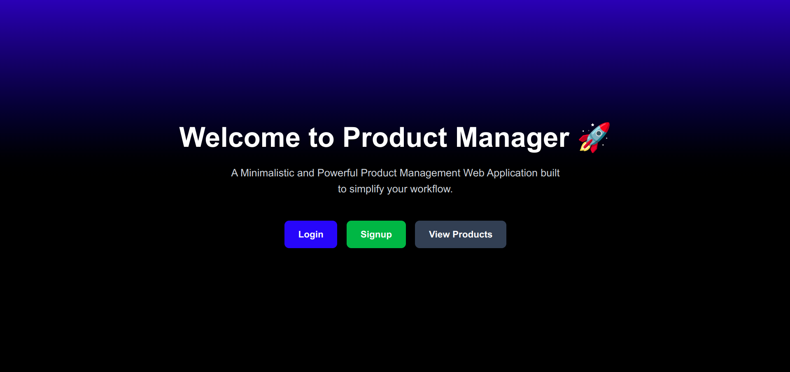
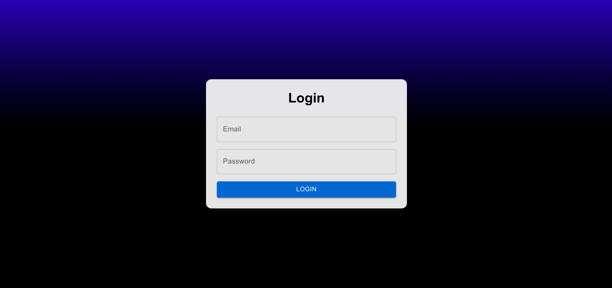
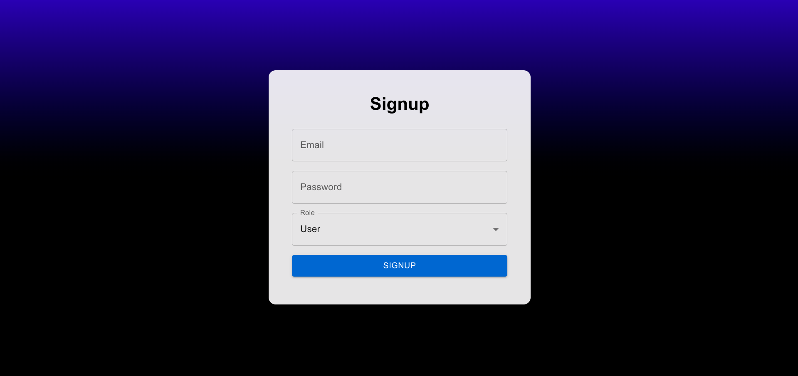
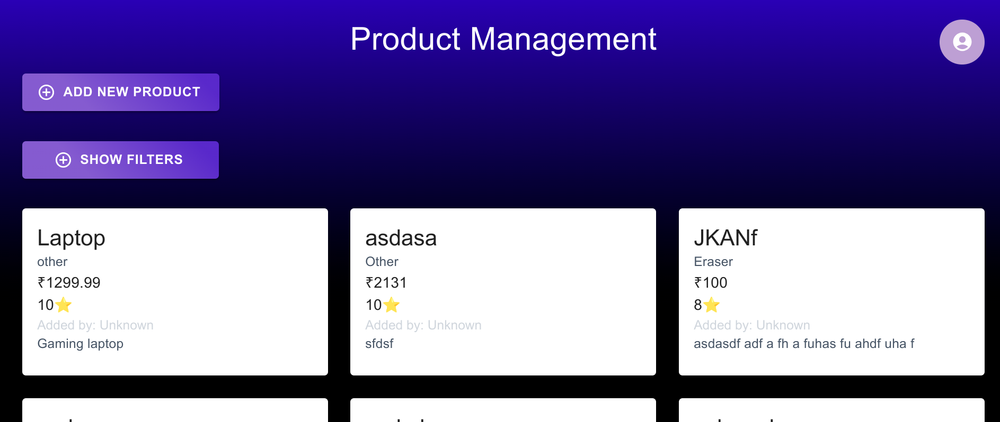
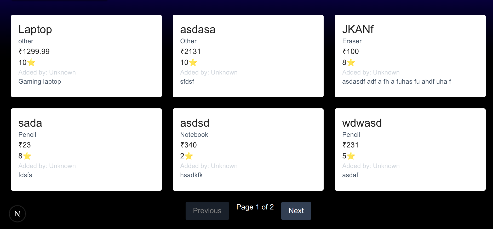
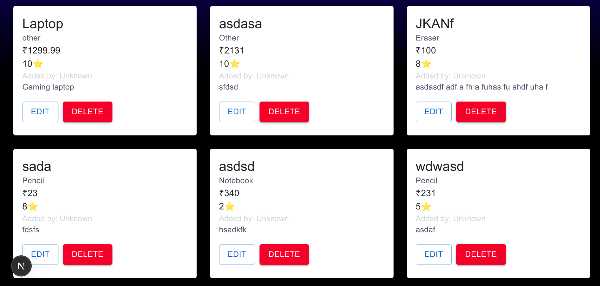
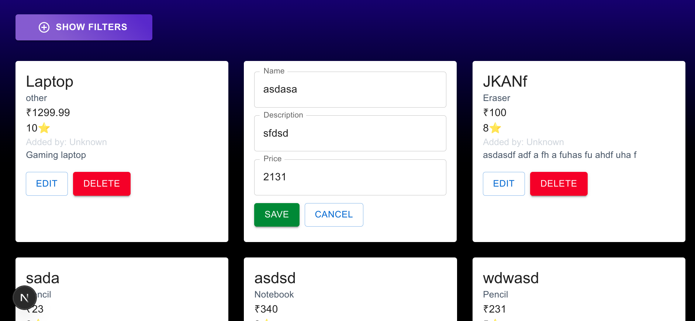
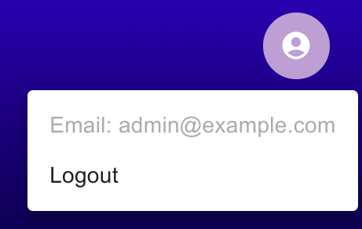

# 🛍️ Product Management

A full-stack web application by [JoyBoy-00](https://github.com/JoyBoy-00) for managing products with secure authentication, admin-level controls, and user-friendly features.

---

## 🚀 Features

✅ **Authentication**  
- JWT-based login and role-based access control  
- Protected routes (users must log in to access `/products`)

✅ **Product Management**  
- Add, edit, delete products (admin only)  
- View product list with filters: search, category, rating, price range, sorting  
- Pagination support for efficient browsing  
- Displays who added each product (`createdBy` field)

✅ **Frontend (Next.js + React)**  
- Responsive UI  
- Built with TailwindCSS + Material UI  
- Live filtering, smooth pagination, and intuitive UX

✅ **Backend (NestJS + MongoDB)**  
- RESTful API  
- Secure product creation linked to authenticated user's email  
- Mongoose schemas  
- Guards and role decorators for route protection

---

## 🧱 Tech Stack

| Layer       | Tech Stack                                           |
|-------------|------------------------------------------------------|
| Frontend    | Next.js, React, TypeScript, TailwindCSS, Material UI |
| Backend     | NestJS, TypeScript                                   |
| Database    | MongoDB (via Mongoose)                               |
| Auth        | JWT                                                  |
| Deployment  | Vercel (Frontend) + Render (Backend)                 |

---

## 📦 Getting Started Locally

## 📥 Clone the Repository

```bash
git clone https://github.com/JoyBoy-00/Product-Management.git
cd Product-Management
```

### 🔧 Backend Setup

```bash
cd backend
npm install
cp .env.example .env
# Fill in MONGODB_URI
 and MY_CUSTOM_JWT_KEY in the .env file
npm run start:dev
```

### 🎨 Frontend Setup

```bash
cd frontend
npm install
cp .env.example .env
# Fill in NEXT_PUBLIC_BACKEND_URL
npm run dev
```

## 🔐 Authentication Flow

JWT is saved to `localStorage` on login  
All authenticated API calls use `Authorization: Bearer <token>`  
Admins can add/edit/delete products, regular users can only view

---

## 🔎 Product Filters

✅ Search by name  
✅ Filter by category  
✅ Min/Max price range  
✅ Minimum rating  
✅ Sort by price/rating (asc/desc)  
✅ Pagination (6 per page)

---

## 🧪 Screenshots (Add yours)

| Home | Login | Products |
|------|-------|----------|
||  |  |

| Product | Page | Admin Page |
|------|-------|----------|
||  |  |

| Admin CRUD | Logout |
|------|-------|
||  |

---
---
---

## 🙌 Made By

Built with 💙 by [JoyBoy-00](https://github.com/JoyBoy-00)  
Feel free to fork, contribute, or give a ⭐ on GitHub!

---

## 💡 Future Improvements

- Product images  
- Registration system  
- Admin dashboard  
- Theme toggle (light/dark)  
- Full test coverage


